# Flowio

Welcome to Flowio, the app where you can create tasks quickly and efficiently.

### Images

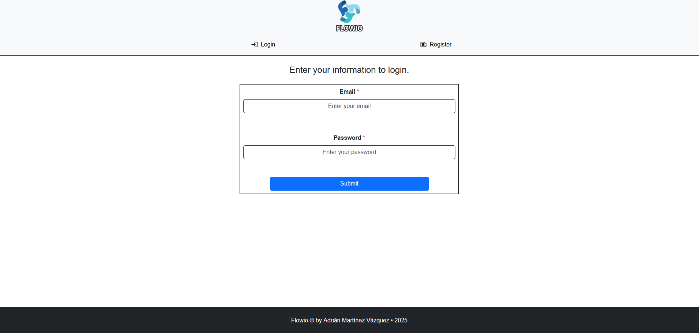

---

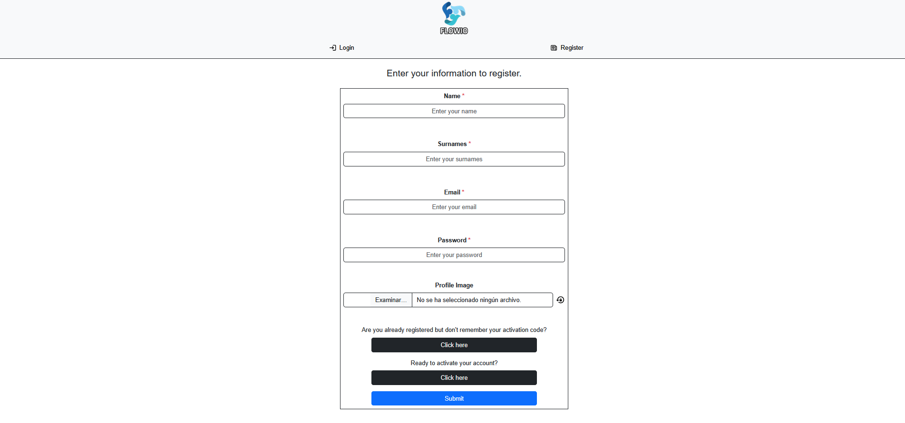

---

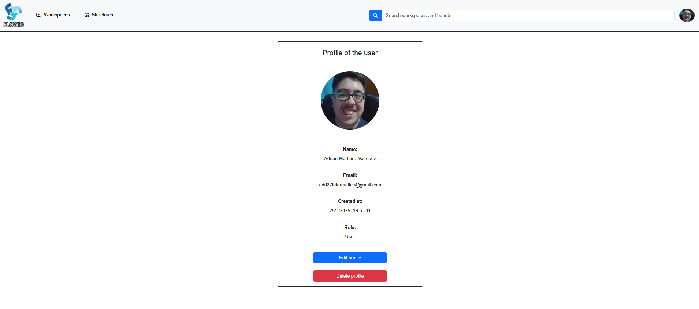

---

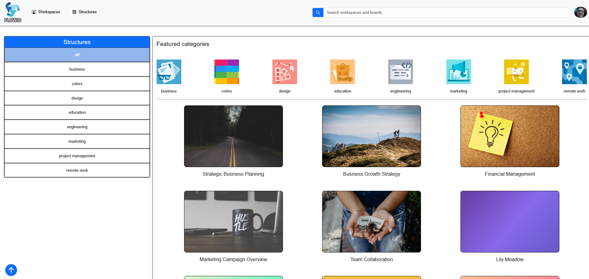

---

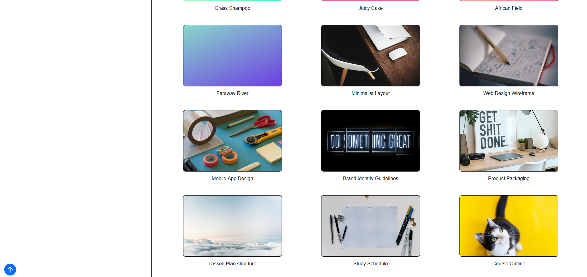

---

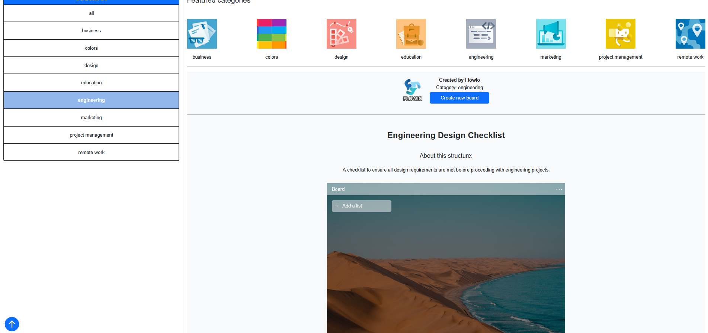

---

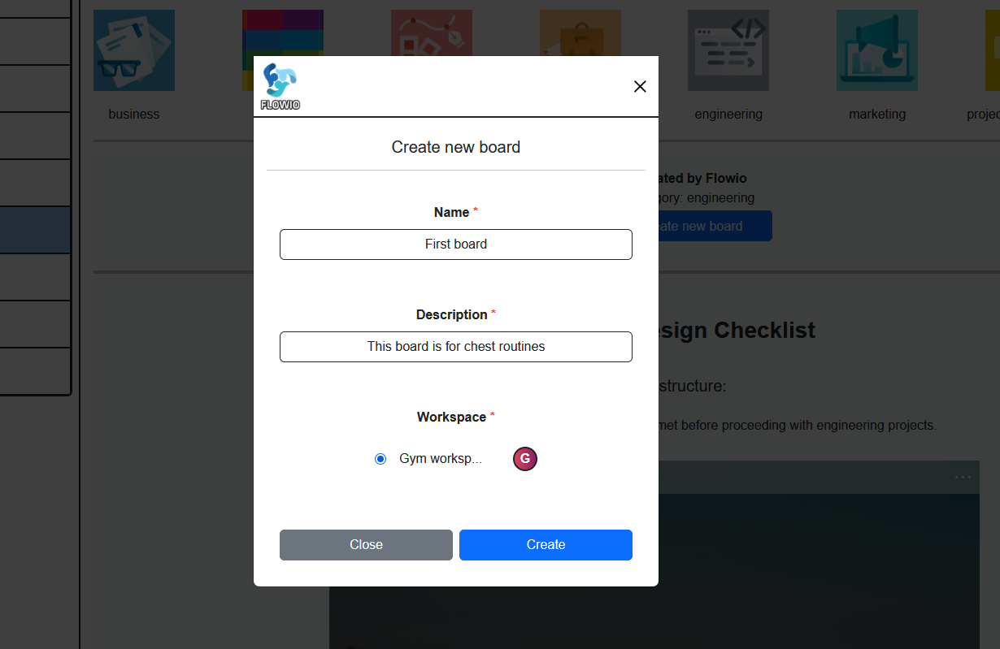

---

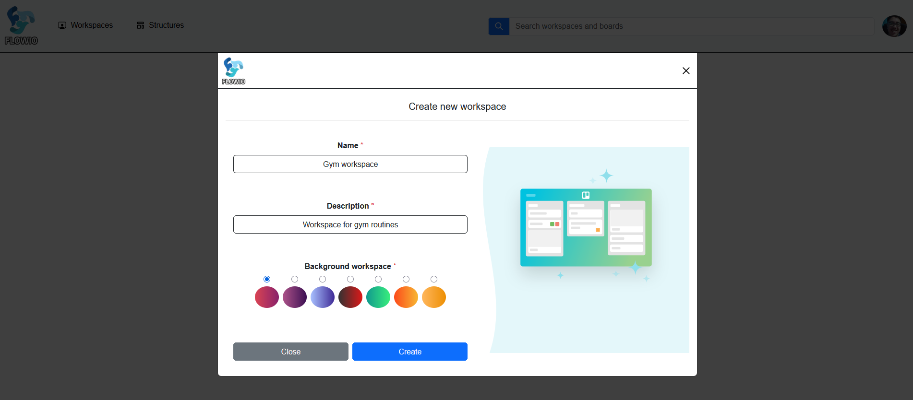

---

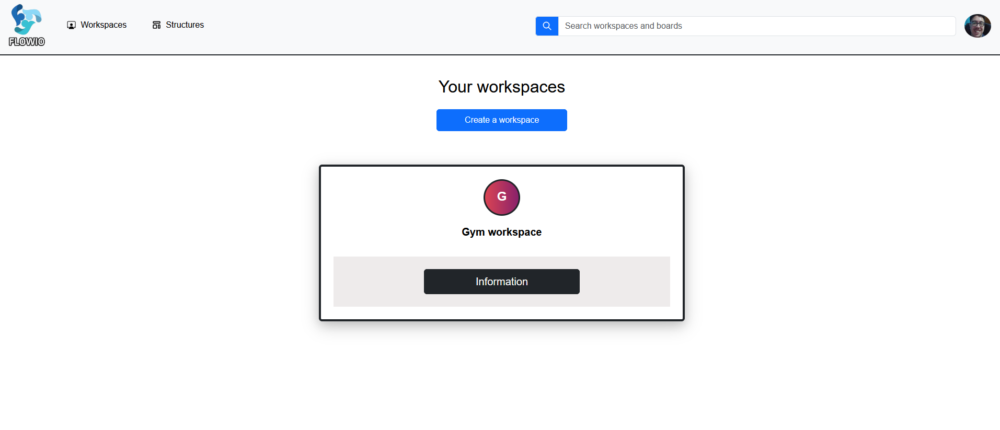

---

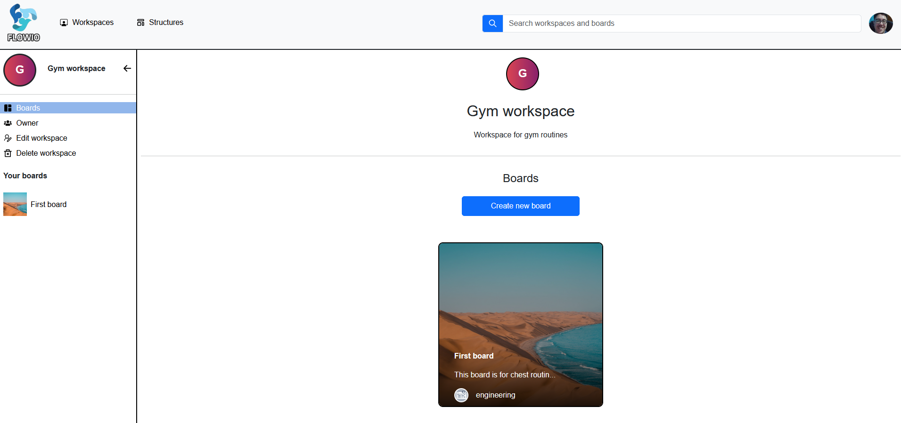

---

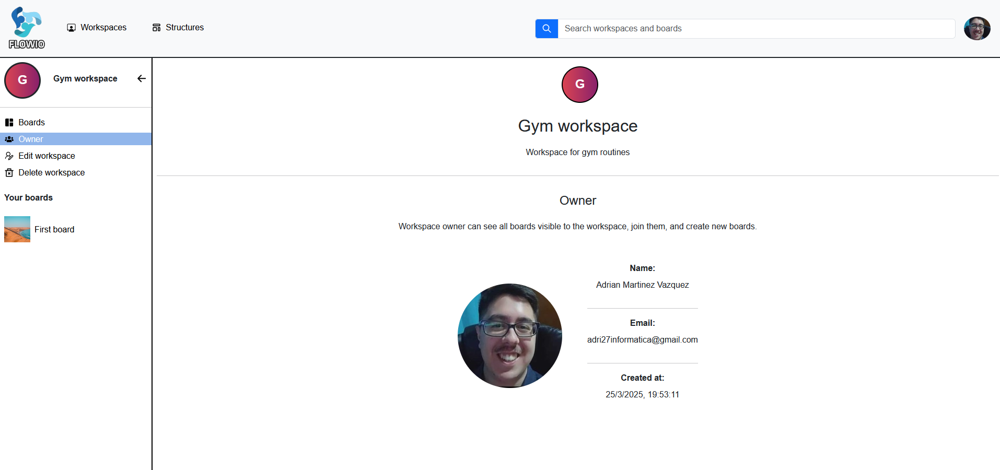

---

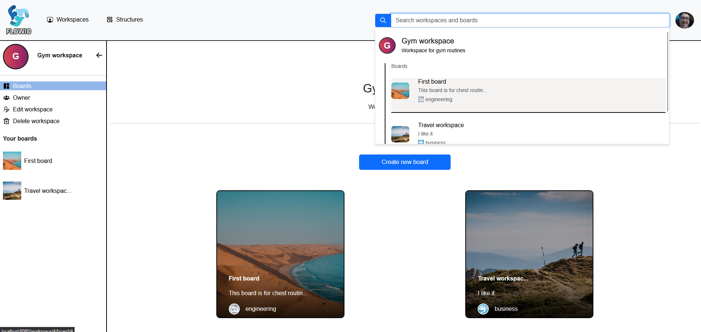

---

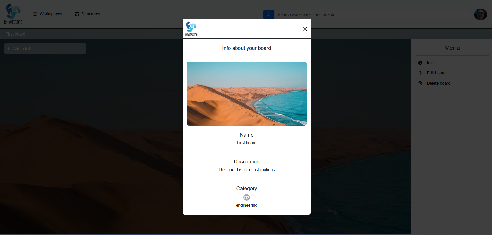

---

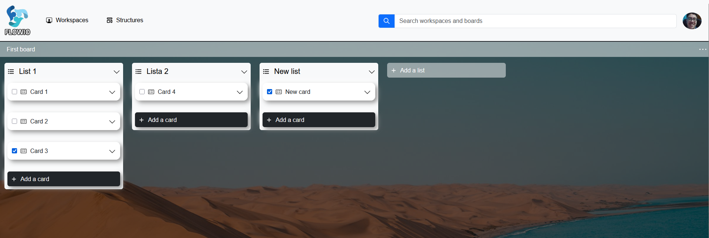

### Features

- Sending emails when the user registers or wants to obtain another activation code using Celery Signals.
- Storing static files and media using AWS's S3 service.
- Cache and CDN services using AWS's Cloudfront service.
- Invalidating user profile images once they are deleted.
- User authentication using JWT.
- Handling refresh token denials using a blacklist.
- Exception handling on app endpoints.
- Permission and error validations throughout the app.
- 100% responsive design.
- Intuitive search for workspaces and boards.
- Creating, editing, and deleting workspaces.
- Creating, editing, and deleting boards.
- Create, edit, and delete lists and cards.
- Create, edit, delete, and register users in the app.

### Technologies

- VUE
- DJANGO
- BOOTSTRAP
- DOCKER
- AWS (S3, CLOUDFRONT)
- CELERY
- REDIS
- GIT
- HTML
- CSS
- JS

## Requirements

Before starting, make sure you have the following installed:

- [Docker Desktop](https://www.docker.com/products/docker-desktop/): Docker Desktop is required to run the app.

- [Amazon Web Services - AWS](https://aws.amazon.com/): You will need an AWS account since the app uses AWS services such as S3 (for file storage) and CloudFront (for content distribution).

- [Gmail](https://gmail.com/): A Gmail account is required to send activation emails for your new user account within the app.

## AWS Setup

The app uses **Amazon S3** and **Amazon CloudFront** services, so you'll need to configure your AWS credentials and create the necessary resources. Follow these steps:

### 1. **Create an AWS Account**

If you don't have an AWS account, you can create one [here](https://aws.amazon.com/).

### 2. **Create an IAM User**

To interact securely with AWS services, you need to create an IAM (Identity and Access Management) user with the necessary permissions.

1. Go to the [AWS Management Console](https://aws.amazon.com/console/) and log in with your account.

2. Navigate to **IAM** (in the services menu).

3. On the left menu, select **Users**, then click **Add User**.

4. Give the user a name (e.g., `flowio-test-user`) and proceed.

5. In **Permissions**, select **Attach policies directly** and assign the following policies:

   - **AmazonS3FullAccess** (for S3 access)
   - **CloudFrontFullAccess** (to manage CloudFront)

6. Finish creating the user, and then create an access key to copy the **ACCESS KEY** and **SECRET KEY**. Make sure to save them.

### 3. **Configure AWS Credentials in your `.env` File**

Now that you have the IAM user, configure your AWS credentials in the `.env` file of your backend. Add the following lines to your `.env` file:

```env
USE_S3=True
AWS_ACCESS_KEY_ID="your_aws_access_key_id"
AWS_SECRET_ACCESS_KEY="your_aws_secret_access_key"
```

## Configuring Amazon S3 for File Storage

The app uses Amazon S3 to store static and media files. Here's how to create and configure an S3 bucket:

### 1. Access the Amazon S3 Console

Log in to your AWS account and go to the [Amazon S3](https://s3.console.aws.amazon.com/s3/home).

### 2. Create a New Bucket

- Go to the S3 service.

- Click on Create bucket.

- In the Bucket name field, enter a unique name for your bucket (e.g., flowio-files).

- Select your preferred region (I recommend using the closest region to your location or your users).

- Leave the rest of the settings as AWS recommends.

- Click Create bucket to complete the creation.

### 3. Configure Access Permissions

- Go to the bucket settings and select the Permissions tab.

- Under Block public access, turn it off.

### 4. Get the Bucket Name and Region

- In the S3 console, click on the bucket name you just created.

- Save the bucket name (e.g., flowio-bucket-test) and the region you selected, as you'll need this information later to configure it in your backend's .env file.

### 5. Set Bucket Policy and Access Permissions

You need to create a custom policy for the S3 bucket. Go to the Permissions tab and select Bucket policy. Click on Edit and add the following:

```
{
	"Version": "2008-10-17",
	"Id": "PolicyForCloudFrontPrivateContent",
	"Statement": [
		{
			"Sid": "AllowCloudFrontServicePrincipal",
			"Effect": "Allow",
			"Principal": {
				"Service": "cloudfront.amazonaws.com"
			},
			"Action": "s3:GetObject",
			"Resource": "arn:aws:s3:::<YOUR-BUCKET-NAME>/*",
			"Condition": {
				"StringEquals": {
					"AWS:SourceArn": "arn:aws:cloudfront::<YOUR-AWS-ACCOUNT-ID>:distribution/<YOUR-DISTRIBUTION-ID>"
				}
			}
		}
	]
}
```

Replace the following values with your actual data:

    <YOUR-BUCKET-NAME>: The name of your S3 bucket (e.g., flowio-bucket-test).

    <YOUR-AWS-ACCOUNT-ID>: Your AWS account ID.

    <YOUR-DISTRIBUTION-ID>: The distribution ID of the CloudFront distribution that we will create after setting up this S3 bucket.

### 6. Configure the Media Directory Inside the Bucket

You need to create the path your_bucket_name/flowio/media/attachments/user/default/user_default.png. This path is necessary because when a user registers without selecting an image, this default path will be assigned, which is required. Regarding the static directory, it will be automatically created inside the bucket when the collectstatic command is run.

## Configuring Amazon CloudFront for Content Distribution

The app also uses Amazon CloudFront as a CDN to efficiently distribute the files stored in S3. Follow these steps to set up a CloudFront distribution:

### 1. Access the CloudFront Console

Log in to your AWS account and go to [Amazon CloudFront](https://console.aws.amazon.com/cloudfront).

### 2. Create a CloudFront Distribution

- Click on Create Distribution.

- In Origin Domain Name, select the S3 bucket you created earlier.

- In Origin Access, select Origin access control settings (recommended).

- Leave the rest of the settings as default.

- Click Create Distribution.

### 3. Get the CloudFront URL

Once the distribution is created, you'll find a URL in the Domain Name field of the distribution. This URL will be used to access the static files from your frontend (e.g., d1234abcd1234.cloudfront.net). Make sure to save the distribution ID as well.

### 4. Configure the Distribution in Your Application

In your .env file, now that you have everything you need for the S3 and CloudFront services, add the necessary environment variables to the backend's .env file:

```env
USE_S3=True
AWS_ACCESS_KEY_ID="your_aws_access_key_id"
AWS_SECRET_ACCESS_KEY="your_aws_secret_access_key"
AWS_STORAGE_BUCKET_NAME="your_s3_bucket_name"  <> example: flowio-bucket-test
AWS_DEFAULT_REGION="your_aws_region" <> example: eu-west-3
AWS_S3_CUSTOM_DOMAIN="your_cloudfront_domain" <> example: d1234abcd1234.cloudfront.net
AWS_S3_FILE_OVERWRITE=True
AWS_S3_CACHE_CONTROL="max-age=2592000, public"
CLOUDFRONT_DISTRIBUTION_ID="your_cloudfront_distribution_id" <> example: E1534SE5XAMOXA
```

## Configuring Gmail Account for Sending Emails

The app uses an authorized Gmail account to send emails. If you have two-step verification (2FA) enabled on your Gmail account, you'll need to generate an App Password to allow the app to send emails.

### Steps to Generate an App Password (for accounts with 2FA enabled):

1. Access Your Google Account::

   - Log in to your Gmail (or Google) account [aquí](https://myaccount.google.com).

2. Go to the Security Section:

   - On the left sidebar, select Security.

3. Generate an App Password:

   - In the Google Account Access section, under App passwords, select Generate.

   - If you don’t see this option, ensure that two-step verification is enabled for your account.

4. Select the App and Device:

   - Choose Mail for the app and Other (Custom name) to give this password a name (e.g., "Flowio App").

   - Click Generate.

5. Copy the App Password:

   - A password will be generated. Copy it.

6. Update Your .env File:

   - Now, instead of using your regular Gmail password, use the App Password you generated in your .env file for email configuration

   ```env
   EMAIL_HOST="smtp.gmail.com"
   EMAIL_PORT=587
   EMAIL_USE_TLS=True
   EMAIL_HOST_USER="your_gmail_account@gmail.com"
   EMAIL_HOST_PASSWORD="your_generated_app_password"
   ```

   Make sure to replace `"your_generated_app_password"` with the app password you generated.

   IMPORTANT!! The email may not be sent because you have an antivirus on your computer that is blocking it. This is a normal occurrence, and to test the app, you'll need to disable your antivirus, as some antiviruses, such as Avast, block the SSL certificate and prevent emails from being sent.

### Summary

The App Password will allow Gmail to send emails from the app without disabling two-step verification. It's a security step recommended by Google when using external services with 2FA enabled.

Finally, you'll have configured the AWS and Gmail services. The next step would be to review the backend .env.sample file and finalize the configuration. Regarding the frontend .env file, if we review its .env.sample, the last four variables related to the 'your_cloudfront_worspace_bg_modal_image_url' key refer to the cloudfront domain I previously told you to build:

- VITE_DEFAULT_PROFILE_IMAGE_URL="your_cloudfront_default_profile_image_url/flowio/media/attachments/user/default/user_default.png"

- VITE_DEFAULT_LOGO_IMAGE_URL="your_cloudfront_default_logo_image_url/flowio/static/utils/logos/app/logo.png"

- VITE_DEFAULT_WORKSPACE_LOGO_MODAL_IMAGE_URL="your_cloudfront_worspace_logo_modal_image_url/flowio/static/utils/logos/workspace/workspace_logo.svg"

- VITE_DEFAULT_WORKSPACE_BG_MODAL_IMAGE_URL="your_cloudfront_worspace_bg_modal_image_url/flowio/static/utils/logos/workspace/bg_workspace_logo.svg"

  Example: d1234abcd1234.cloudfront.net/

Remember that these urls are generated once those paths are created within the S3 bucket youset up earlier. If they are not created, the urls you put in your new .env file for the frontend will fail. Additionally, I'll leave you to check the static directory of the backend, where you can see the references to the directories that will be created in your S3 bucket once the backend script runs and executes the collectstatic command. This command connects to the S3 bucket if everything is correctly configured. Additionally, in the backend static directory, you'll find all the images used in the app.

## Start the project

Once you have configured both `.env` files for the frontend and backend, follow these steps to run the app:

1. Clone this project using:

   ```sh
   git clone https://github.com/adri27info/flowio.git
   ```

2. Start the Docker Desktop application.

3. Open your development environment (I use VS Code).

4. Inside your development environment, you can start the app in two ways:

   1. Navigate to the utils directory at the root of the project and run the start.sh script to launch the app. To stop the app, use the down.sh script.

   2. Navigate first to the backend directory and run:

   ```sh
   docker-compose up -d
   ```

   Then, move to the frontend directory and execute the same command. Keep in mind that the first startup may take around 1 to 2 minutes.

## License

This project is licensed under the MIT License - see the [LICENSE](./utils/licenses/LICENSE) file for details.
